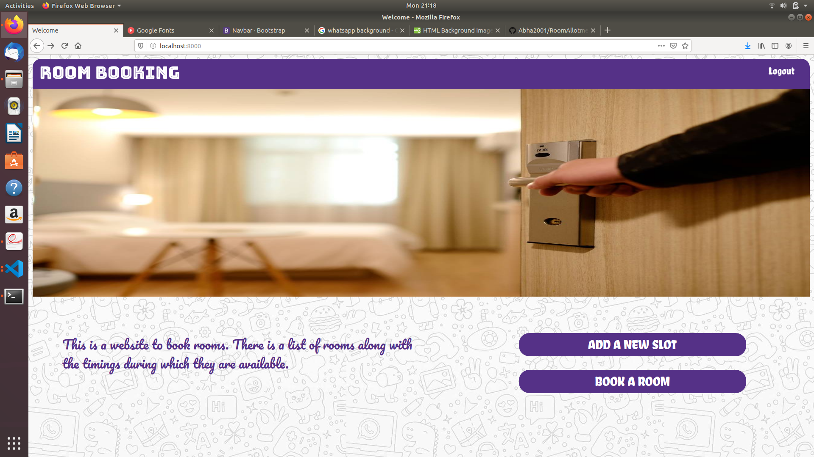
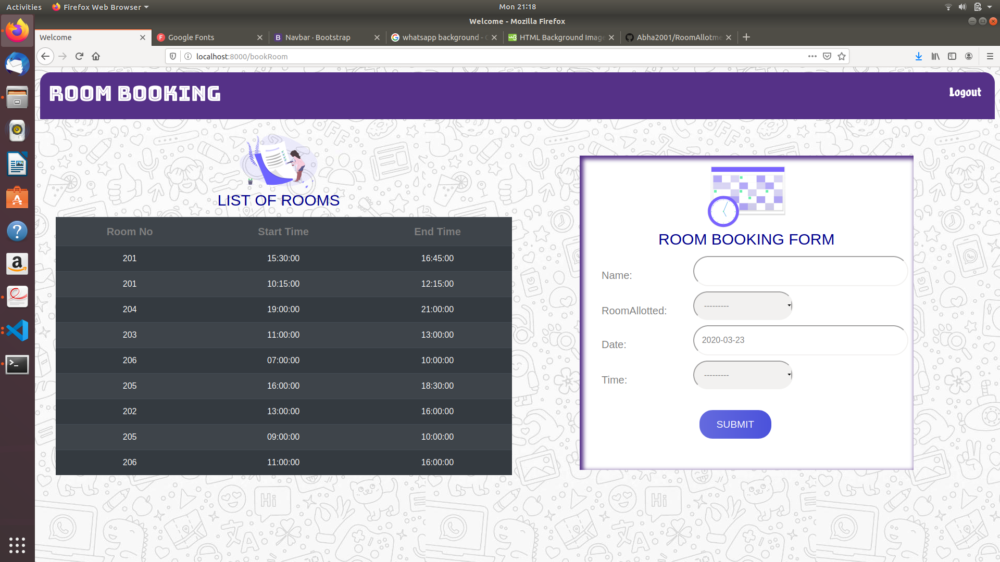
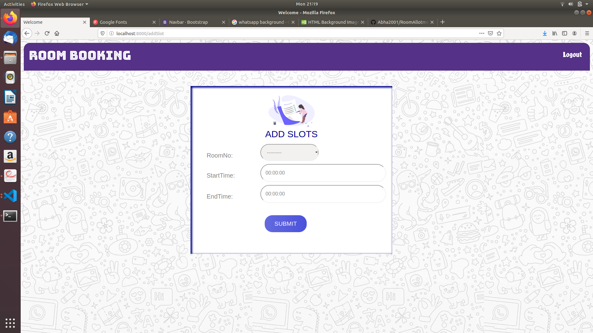

# RoomBookingSite

This is a Room booking system made using Django,HTML,CSS which has admin and normal user access. Admin can allot if a room is available. Booking is to be made from a list which displays the timings of availability of each room.

## Getting started

* Move into the desired folder

* Create virtual environment

`python3 -m venv venv`

`source venv/bin/activate`  

* Clone the repo

`git clone https://github.com/Abha2001/RoomAllotment.git`

* Change the directory

`cd RoomAllotment`

* install django

`pip install django`

* run migrations

`python manage.py makemigrations`

`python manage.py migrate`

* run the server

`python manage.py runserver`

* Go to server localhost:8000

# Prerequisites

python3

## The screenshot of the App

### home page:

### booking list and form

### adding new slots

